# Blockchain Homework

The project is to set up a private testnet to explore potentials for blockchain.

We have to set up a testnet and the first block:

First Use the <Geth> command-line tool, to create keys, initialize nodes, and connect the nodes together.

<Puppeth>, to generate your genesis block.

We configure the Authority algorithm as Clique Proof

Here is the  folder inside of the project directory

## Node 1
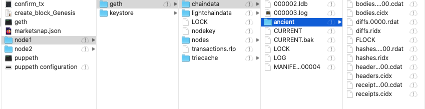

## Node 2
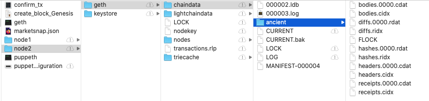

The network name created was "marketsnap" with ChainID = 322

## Steps to create th puppeth, network "marketsnap"  

Genesis configuration file is marketsnap.json

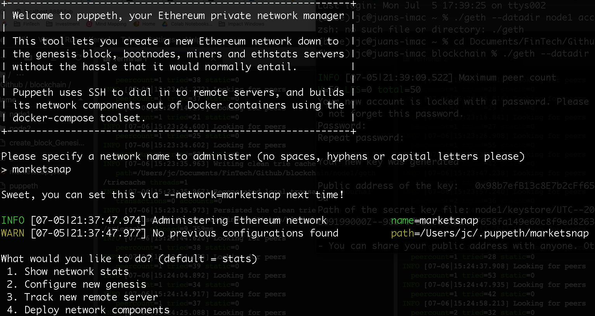 

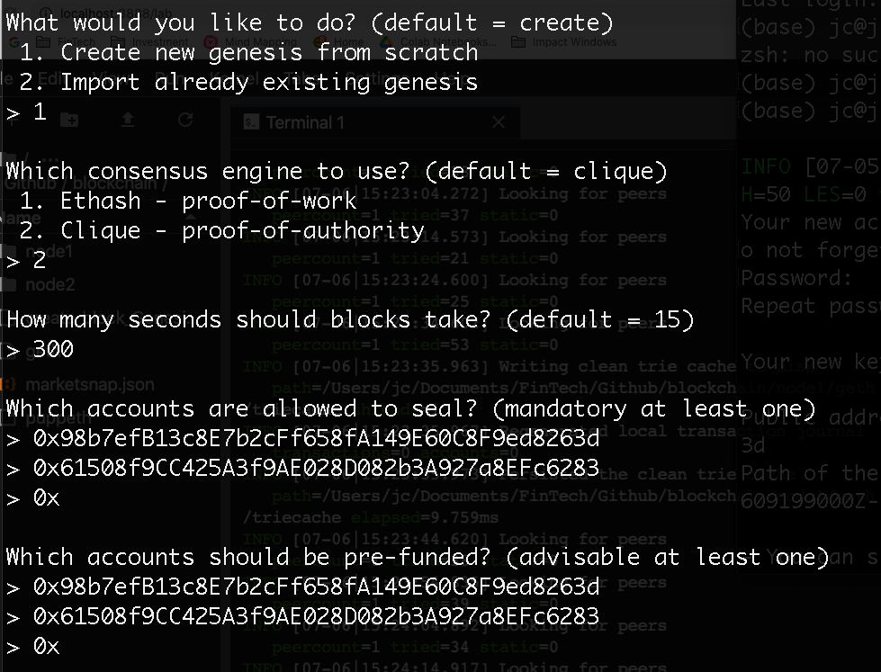 

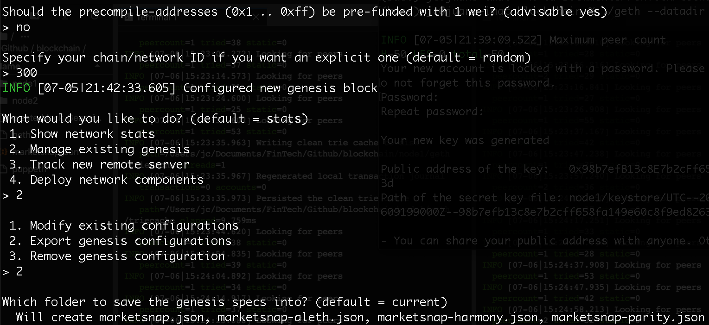 

## JSON files with network configuration
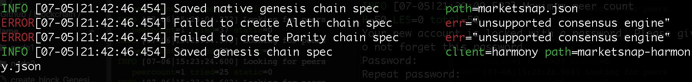

Running the first node, (make sure to unlock the account, with creation password), enable mining, and the RPC flag. Then enabling mining on the second node! (different peer port for the second node)

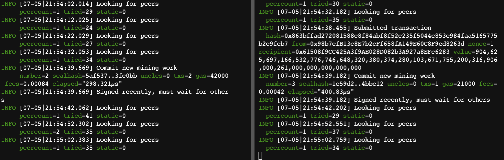

Open MyCrypto GUI wallet to connect to the node and create a custom network with the chain ID=300

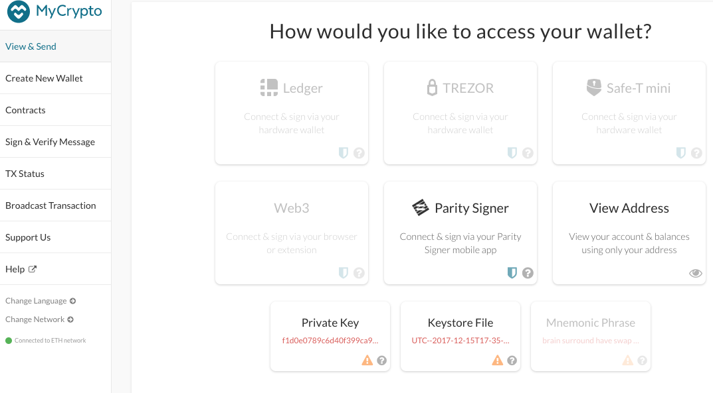

## My Crypto using custom node and custom network

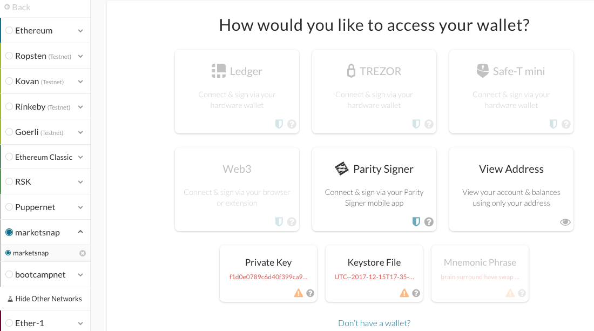

## Send a transaction from the node1 account to the node2 account.

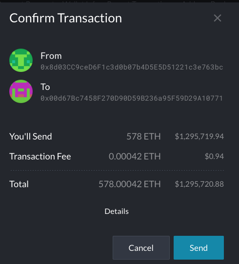

Validating transaction status using transaction hash "TX Status" (two status, pending and sucessfull)

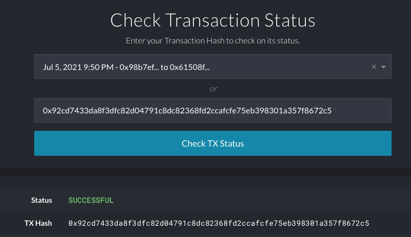

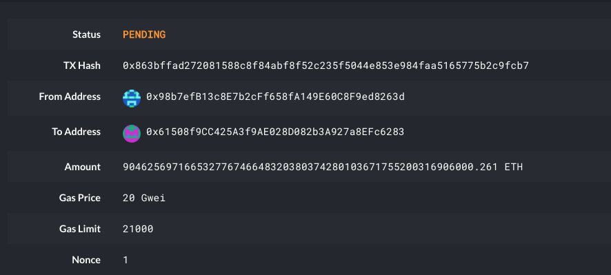

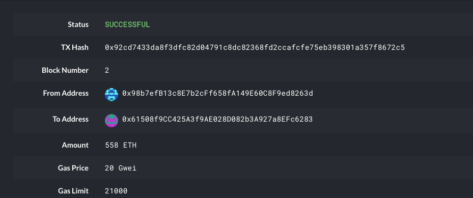

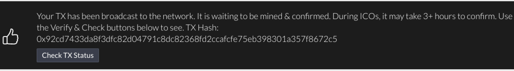

